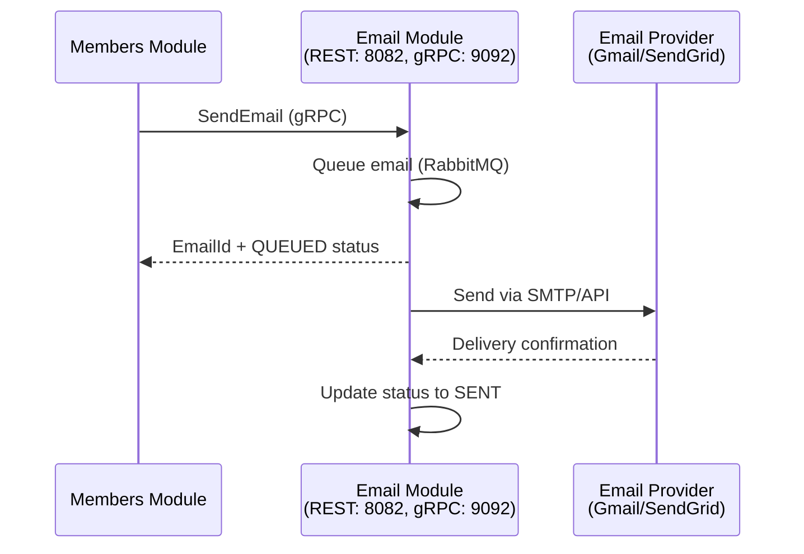

# EcclesiaFlow Email Module

[](https://openjdk.java.net/projects/jdk/21/)
[](https://spring.io/projects/spring-boot)
[](https://grpc.io/)
[](https://dev.mysql.com/downloads/mysql/)
[](LICENSE)
[](https://swagger.io/specification/)

> **Transactional email service for the EcclesiaFlow platform**

Microservice dedicated to email sending and tracking: transactional emails, template management, multi-provider support, and queue processing. Designed following Clean Architecture principles with clear separation of responsibilities.

---

## Table of Contents

- [Overview](#overview)
- [Module Features](#module-features)
- [Project Structure](#project-structure)
- [Clean Architecture - 4 Layers](#clean-architecture---4-layers)
- [EcclesiaFlow Ecosystem](#ecclesiaflow-ecosystem)
- [Technology Stack](#technology-stack)
- [Quick Start](#quick-start)
- [API Examples](#api-examples)
- [Configuration](#configuration)
- [Testing and Quality](#testing-and-quality)
- [License](#license)

---

## Overview

The **EcclesiaFlow Email Module** is a specialized microservice for transactional email management. It is part of the EcclesiaFlow ecosystem, a multi-tenant SaaS platform where each church operates as an independent tenant.

### **Module Responsibilities**

- **Email Sending**: Transactional emails via multiple providers (Gmail, SendGrid)
- **Template Management**: Thymeleaf templates for password reset, welcome, confirmation
- **Queue Processing**: RabbitMQ async with retry and dead letter queue
- **Email Tracking**: Status tracking (queued, sent, delivered, failed, bounced)
- **gRPC Services**: High-performance inter-service communication
- **Clean Architecture**: Clear separation of layers (Web, Business, IO, Application)



---

## Module Features

* **Multi-Provider Support** – Gmail SMTP and SendGrid with automatic failover
* **Template Engine** – Thymeleaf templates with variable substitution
* **Queue Processing** – RabbitMQ with retry queue and dead letter queue
* **Email Tracking** – Status tracking: QUEUED → SENT → DELIVERED / FAILED / BOUNCED
* **gRPC Services** – High-performance Protocol Buffers with Health checks
* **REST API** – OpenAPI 3.1.1 documented endpoints
* **Clean Architecture** – 4 layers: Web, Business, IO, Application
* **AOP Logging** – Centralized aspect-based logging with MDC support
* **Security Masking** – Sensitive data masked in logs (emails, IDs, tokens)
* **Comprehensive Testing** – JaCoCo coverage with unit tests

---

## Project Structure

```
ecclesiaflow-email-module/
├── src/
│   ├── main/
│   │   ├── java/com/ecclesiaflow/email/
│   │   │   ├── application/          # Config, Jobs, Logging, Messaging
│   │   │   ├── business/             # Domain, Services, Exceptions
│   │   │   ├── io/                   # Persistence, gRPC, Providers
│   │   │   ├── web/                  # Controllers, DTOs, Mappers
│   │   │   └── EmailModuleApplication.java
│   │   ├── proto/
│   │   │   └── email_service.proto
│   │   └── resources/
│   │       ├── api/email-api.yaml
│   │       ├── templates/emails/
│   │       └── application.properties
│   └── test/
│       └── java/com/ecclesiaflow/email/
└── pom.xml
```

---

## Architecture - 4 Layers

### **Web Layer** (`com.ecclesiaflow.communication.web`)
- **Delegate**: `EmailApiDelegateImpl` - REST API implementation
- **DTOs**: Generated from OpenAPI specification
- **Mappers**: `EmailDtoMapper` - Domain ↔ DTO conversion
- **Exceptions**: `GlobalExceptionHandler` - Centralized error handling

### **Business Layer** (`com.ecclesiaflow.communication.business`)
- **Services**: `EmailService`, `TemplateService`, `TemplateResolver`
- **Domain**: `Email`, `EmailStatus`, `EmailPriority`, `EmailProvider`
- **Ports**: `EmailRepository` (interface)
- **Exceptions**: `EmailNotFoundException`, `EmailSendingException`

### **IO Layer** (`com.ecclesiaflow.communication.io`)
- **Persistence**: JPA entities, Spring Data repositories, MapStruct mappers
- **Providers**: `GmailSmtpProvider`, `SendGridProvider`
- **gRPC Server**: `EmailGrpcServiceImpl`

### **Application Layer** (`com.ecclesiaflow.communication.application`)
- **Config**: `RabbitMQConfig`, `AsyncConfig`, `EmailConfigurationProperties`
- **Jobs**: `EmailQueueProcessor` - Scheduled queue processing
- **Messaging**: `EmailMessagePublisher`, `EmailMessageListener`
- **Logging**: AOP aspects with `SecurityMaskingUtils`

---

## EcclesiaFlow Ecosystem

* **Email Module** (This module)
  - **REST API**: Port 8082
  - **gRPC Server**: Port 9092
  - **Role**: Email sending and tracking

* **Members Module**
  - **REST API**: Port 8080
  - **gRPC Server**: Port 9091
  - **Role**: Member management and confirmation

* **Authentication Module**
  - **REST API**: Port 8081
  - **gRPC Server**: Port 9090
  - **Role**: JWT authentication and password management

### **Communication Architecture**

```
┌─────────────────────────────────────────────────────────────┐
│                      Client (HTTP)                          │
└──────────────┬──────────────────┬──────────────┬────────────┘
               │ REST (8080)      │ REST (8081)  │ REST (8082)
               ▼                  ▼              ▼
     ┌─────────────────┐    ┌─────────────┐    ┌─────────────┐
     │  Members Module │    │ Auth Module │    │Email Module │
     │   gRPC: 9091    │    │ gRPC: 9090  │    │ gRPC: 9092  │
     └────────┬────────┘    └──────┬──────┘    └──────▲──────┘
              │                    │                  │
              │         SendEmail (gRPC)              │
              └───────────────────────────────────────┘
```

---

## Technology Stack

* **Backend**: Java 21, Spring Boot 3.5.5
* **Database**: MySQL 9.0.0 with Spring Data JPA
* **Messaging**: RabbitMQ with Spring AMQP
* **Communication**: gRPC 1.60.0, Protocol Buffers 3.25.1
* **Email Providers**: Gmail SMTP, SendGrid API
* **Templates**: Thymeleaf 3.x
* **Documentation**: OpenAPI 3.1.1, SpringDoc, Swagger UI
* **Build**: Maven 3.14.0 with protobuf-maven-plugin
* **Testing**: JUnit 5, Mockito, AssertJ, JaCoCo
* **Logging**: AOP with AspectJ, SLF4J, MDC
* **Mapping**: MapStruct 1.5.5

---

## Quick Start

### 1. Prerequisites

* **Java 21+** (OpenJDK or Oracle JDK)
* **Maven 3.8+** for dependency management
* **MySQL 9.0+** (or MySQL 8.0+ compatible)
* **RabbitMQ** (optional, for async processing)

### 2. Clone Project

```bash
git clone https://github.com/GYOM15/ecclesiaflow-email-module.git
cd ecclesiaflow-communication-module
```

### 3. Database Configuration

```sql
CREATE DATABASE email_module_db CHARACTER SET utf8mb4 COLLATE utf8mb4_unicode_ci;
CREATE USER 'ecclesiaflow'@'localhost' IDENTIFIED BY 'your_secure_password';
GRANT ALL PRIVILEGES ON email_module_db.* TO 'ecclesiaflow'@'localhost';
FLUSH PRIVILEGES;
```

### 4. Application Configuration

```bash
cp src/main/resources/application.properties.example src/main/resources/application.properties
```

**Required configuration:**
```properties
# Database
spring.datasource.url=jdbc:mysql://localhost:3306/email_module_db
spring.datasource.username=ecclesiaflow
spring.datasource.password=your_secure_password

# Email (Gmail)
spring.mail.username=your-email@gmail.com
spring.mail.password=your_gmail_app_password

# SendGrid (optional)
sendgrid.enabled=false
sendgrid.api.key=your_sendgrid_api_key
```

### 5. Start Module

```bash
mvn clean compile
mvn spring-boot:run
```

### 6. Verify Startup

```bash
# Health check
curl http://localhost:8082/actuator/health

# API documentation
open http://localhost:8082/swagger-ui.html
```

---

## API Examples

### **Send Email (REST)**

```bash
curl -X POST "http://localhost:8082/ecclesiaflow/emails" \
  -H "Content-Type: application/json" \
  -d '{
    "to": ["user@example.com"],
    "subject": "Welcome to EcclesiaFlow",
    "templateName": "emails/welcome",
    "variables": {
      "firstName": "John",
      "confirmationLink": "https://app.ecclesiaflow.com/confirm?token=abc123"
    },
    "priority": "HIGH"
  }' | jq .
```

### **Get Email Status (REST)**

```bash
curl -X GET "http://localhost:8082/ecclesiaflow/emails/{emailId}/status" \
  -H "Accept: application/json" | jq .
```

### **Send Email (gRPC)**

```protobuf
// email_service.proto
service EmailService {
  rpc SendEmail(SendEmailRequest) returns (SendEmailResponse);
  rpc GetEmailStatus(EmailStatusRequest) returns (EmailStatusResponse);
  rpc SendBulkEmails(SendBulkEmailsRequest) returns (SendBulkEmailsResponse);
}
```

---

## Configuration

### **Email Providers**

```properties
# Gmail SMTP (Priority 1)
spring.mail.host=smtp.gmail.com
spring.mail.port=587
spring.mail.username=your-email@gmail.com
spring.mail.password=your_gmail_app_password

# SendGrid (Priority 2 - Backup)
sendgrid.enabled=true
sendgrid.api.key=SG.your_api_key
```

### **RabbitMQ**

```properties
rabbitmq.enabled=true
rabbitmq.exchange.email=ecclesiaflow.email.exchange
rabbitmq.queue.email.send=ecclesiaflow.email.send.queue
rabbitmq.queue.email.retry=ecclesiaflow.email.retry.queue
rabbitmq.queue.email.dlq=ecclesiaflow.email.dlq
```

### **gRPC**

```properties
grpc.enabled=true
grpc.server.port=9092
grpc.server.shutdown-timeout-seconds=30
```

---

## Testing and Quality

### **Running Tests**

```bash
# Unit tests
mvn test

# Tests with coverage
mvn clean verify

# View coverage report
open target/site/jacoco/index.html
```

### **Quality Metrics**

- **Test Coverage**: JaCoCo with configurable thresholds
- **Code Style**: Consistent formatting and naming conventions
- **AOP Logging**: Centralized logging without polluting business code
- **Security**: Sensitive data masked in logs via `SecurityMaskingUtils`

---

## Contributing

### **Development Standards**

- **Clean Architecture**: Respect the 4-layer separation (Web, Business, IO, Application)
- **SOLID Principles**: Each class has a single responsibility
- **Documentation**: Javadoc with `@author` and `@since` annotations only
- **Testing**: Minimum 80% coverage with unit tests
- **English Only**: All code, comments, and messages must be in English

### **Git Workflow**

```bash
# 1. Start from development branch
git checkout ecclesiaflow-com-dev

# 2. Create branch for new feature
git checkout -b new-feature

# 3. Develop with atomic commits
git commit -m "Feat(email): add SendGrid provider support"

# 4. Tests and quality
mvn clean test jacoco:report

# 5. Push and Pull Request to ecclesiaflow-com-dev
git push origin new-feature
```

### **Commit Convention**

**Format with type:**
```
Type(scope): description (≤ 50 characters, first letter capitalized)

Message body (≤ 72 characters per line)

Types: Feat, Fix, Docs, Style, Refactor, Test, Chore
Scopes: email, provider, grpc, messaging, persistence, web, logging

NB: scope is optional
```

**Format without type:**
```
Add new feature (≤ 50 characters, first letter capitalized)

Detailed message body if necessary
(≤ 72 characters per line)
```

**Examples:**
- `Feat(email): add SendGrid provider`
- `Fix(grpc): resolve connection timeout issue`
- `Refactor(logging): add MDC support`
- `Test(provider): add Gmail SMTP provider tests`
- `Docs: update README with API examples`
- `Add new feature`
---

## License

MIT License - See [LICENSE](LICENSE) file

---

**Developed for church communities worldwide**
